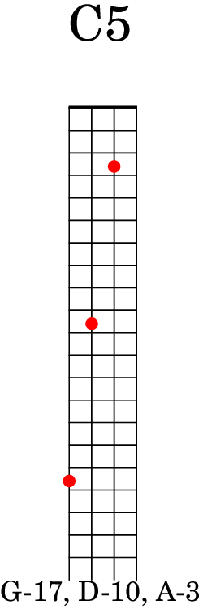

# mandocards

_Note: This was a project I did on an airplane recently to play with Rust and scratch an itch. It's incomplete and mostly just a playground for me_

## Creates an Anki deck for Mandolin notes and fret positions.

Requires `lilypond` application to be installed on the system for notation and fretboard generation.
Does not require `Anki` application to be installed for building, but does for viewing.

Deck is published on AnkiWeb ([link](https://ankiweb.net/shared/info/1820555408)).
## Commands:

**generate**: will create the Lilypond score file: `output/lilypond/mandocard.ly`

**compile**: (currently does not work; instead run the lilypond command directly from within the `output/lilypond` folder) ` lilypond --png -d crop="#t" -d resolution="400" -dno-print-pages --output ../anki/mandocard.ly`

**build**: will generate the anki deck file which can be imported into `Anki`: `output/anki/mandocard.apkg`

## Example

|Front|Back|
|-----|----|
|||